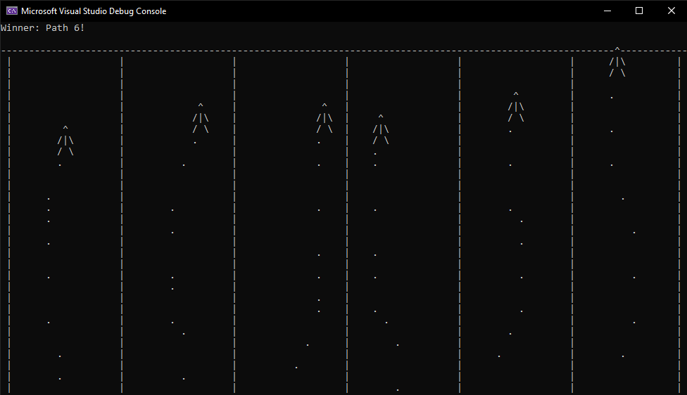

<h1>Overview</h1>

This is a very simple game built in C++ for an introductory computer science class.

It can be ran in Visual Studio, but the terminal window needs to be set to a width of 122 and a height of 40 for it to display properly. As I learn more about programming, I hope to learn how to resize the window within the program itself,
  as well as to just generally expand the features of the game itself.

<h2>Preview</h2>

This is a snippet of how the program currently looks when ran:

