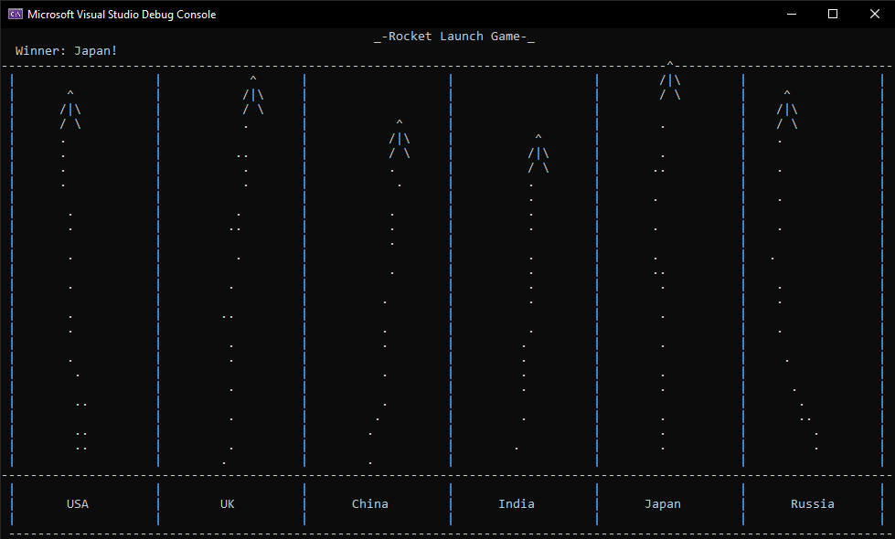

<h1>Overview</h1>

This is a very simple game built in C++ for an introductory computer science class.

The concept is a short racing simulation between six rockets, each representing different countries. The rockets each have randomized, weighted chances to move up, down, left, or right,
and the game ends when one of the rockets either reaches the finish line at the top of the screen or crashes into the left or right boundaries of their paths.

It is intended to be run in Visual Studio, in which it was developed.

<h2>Preview</h2>

This is a snippet of how the program currently looks when run:

